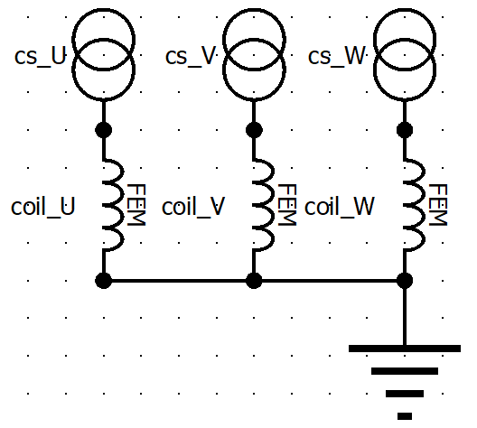

Flux Linkage Analyzer
########################################################################

This analyzer enables the flux linkage evaluation of a mutli-phase electric machine after running 2D FEA simulations using JMAG.

Model Background
****************

The flux linkage of a coil is defined as the amount of flux linking together for a multi-coil arrangment with electric current flowing 
through them. The flux linkage of a coil within an electric machine comes from all coils present in the machine and has a profound 
impact on the machine characteristics. Calculating coil flux linkages over time can lead to inductance calculations for an electric 
machine, which are also important for characterizing that machine. The flux linkage is an important parameter for inductance calculations
as can be seen in the following equation:

.. math::

    L = \lambda I \\

where :math:`\lambda` is the flux linkage, :math:`L` is the inductance, and :math:`I` is the coil current.

The code is structured such that the ``flux_linkage_analyzer`` contains the code for setting up and running the JMAG simulations based on 
1) the machine inputs and conditions of the user and 2) the conditions required of the machine to be able to calculate the 
necessary parameters. In the case of each machine, DC excitement of each phase coil occurs with all other coils open. This repeats for 
each coil until all of the coils have been excited with DC current and all of the flux linkages have been captured. 

This analyzer calculates the self and mutual flux linkages of each coil using JMAG's transient solver. It models an electric machine 
under synchronous operation. The following information document will provide a description of the analyzer inputs and outputs.

Input from User
*********************************

Users are utilizing a single Problem class to interface with this analyzer. This class requires the user to provide an instance of the 
JMAG FEA application being used, a the model of the current project which needs to be in a file that is already open, a dedicated filepath
for the results, the name of the phases, and the rated current of the machine. The specific requirements are summarized below:

.. csv-table:: `flux_linkage_analyzer Inputs`
   :file: input_flux_linkage_analyzer.csv
   :widths: 70, 70, 30
   :header-rows: 1

With regards to the model properties, there are several aspects of the JMAG FEA model that must be specific such that this analyzer works
properly. Those properties are as follows

1. Must be transient model (can be 2D or 3D)
2. The model must be named "Machine_FluxLinkage_Project"
3. The study must be named "Machine_FluxLinkage_Study"
4. The motion condition must be specified
5. "FEM Coils" must be applied to the winding and linked to the circuit
6. The mesh must already be generated
7. The study properties must be fully defined, except for the csv output, which is defined by the analyzer
8. The circuit must appear similar to the following image, where the current sources are titled "cs_PhaseName"

Example Code
~~~~~~~~~~~~~~~~~~~~~~~~~~~~

The following example demonstrates how to initialize instances of ``Flux_Linkage_Problem`` and ``Flux_Linkage_Analyzer``. An instance of 
JMAG FEA is used in this example and is stored in the ``fluxlinkage_inductance_eval`` folder of the ``mach_eval_examples`` in ``eMach``. 
An example file containing the example code is also found in that folder. The following code runs the flux linkage analyzer using the 
aforementioned example file:

.. code-block:: python

    import os
    import sys
    import numpy as np
    import matplotlib.pyplot as plt
    from time import time as clock_time

    os.chdir(os.path.dirname(__file__))
    sys.path.append("../../../")

    from mach_eval.analyzers.electromagnetic.flux_linkage_analyzer import Flux_Linkage_Problem, Flux_Linkage_Analyzer

    from mach_cad.tools import jmag as JMAG

    filepath = "eMach_location/eMach/examples/mach_eval_examples/fluxlinkage_inductance_eval"
    phasenames = ['U', 'V', 'W']
    ratedcurrent = 20

    ####################################################
    # 01 Setting project name and output folder
    ####################################################

    toolJmag = JMAG.JmagDesigner()
    toolJmag.visible = True
    toolJmag.open(filepath + "/Example_FluxLinkage_Machine.jproj")

    # Create output folder
    results_filepath = filepath + "/run_data/"
    if not os.path.isdir(results_filepath):
        os.makedirs(results_filepath)

    project_name = "Machine_FluxLinkage_Project"

    if not os.path.isdir(results_filepath):
        os.makedirs(results_filepath)

    app = toolJmag.jd
    model = app.GetCurrentModel()

    # Pre-processing
    model.SetName(project_name)

This example code does the following:
1. Initializes all of the required libraries and classes
2. Defines the necessary inputs of the ``problem`` and ``analyzer`` classes
3. Opens a fully-defined instance of JMAG
4. Defines the output file location based
5. Names project accordingly

Output to User
**********************************

The ``flux_linkage_analyzer`` returns a directory holding the results obtained from the transient analysis of the machine. The elements 
of this dictionary and their descriptions are provided below:

.. csv-table:: `flux_linkage_analyzer Output`
   :file: output_flux_linkage_analyzer.csv
   :widths: 70, 70
   :header-rows: 1

The following code should be used to run the example analysis:

.. code-block:: python

    ############################ Create Evaluator #####################
    tic = clock_time()
    flux_linkage_prob = Flux_Linkage_Problem(app, model, results_filepath, phasenames, ratedcurrent)
    flux_linkage_analyzer = Flux_Linkage_Analyzer()
    fea_data = flux_linkage_analyzer.analyze(flux_linkage_prob)
    toc = clock_time()
    print("Time spent on the flux linkage evaluation is %g min." % ((toc- tic)/60))

    csv_folder = fea_data["csv_folder"]
    study_name = fea_data["study_name"]
    current_peak = fea_data["current_peak"]
    rotor_angle = fea_data["rotor_angle"]
    name_of_phases = fea_data["name_of_phases"]

    print("\n************************ FLUX LINKAGE RESULTS ************************")
    print("path = ", csv_folder)
    print("study_name = ", study_name)
    print("I_hat = ", current_peak, " A")
    print("rotor_angle = ", rotor_angle[0], " deg")
    print("name_of_phases = ", name_of_phases)
    print("*************************************************************************\n")

This example, contained in the aforementioned ``fluxlinkage_inductance_eval`` folder, should produce the following results:

.. csv-table:: `flux_linkage_analyzer Results`
   :file: results_flux_linkage_analyzer.csv
   :widths: 70, 70, 30
   :header-rows: 1

One should expect the csv_folder location to differ depending on where the desired destination is. Within the ``resuls_folder`` there should be a 
total of 4 csv files that contains the flux linkage calculations for a 3 phase machine, there should be 7 csv files for a 6 phase machine, etc. Each 
csv files should contain a total number of columns that equals the phase count of the machine. All of the code shown exists in the 
``fluxlinkage_inductance_evaluator.py`` file in the ``eMach/examples/mach_eval_examples/fluxlinkage_inductance_eval`` folder. This analyzer serves
as a first step in conjunction with the  `Inductance Analyzer <https://emach.readthedocs.io/en/latest/EM_analyzers/inductance_analyzer.html>`_.