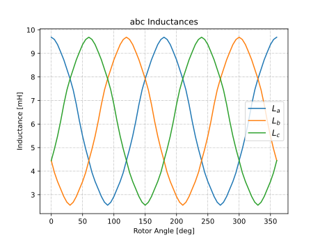

Inductance Analyzer
########################################################################

This analyzer enables the inductance evaluation of a multi-phase electric machine using raw data from 2D FEA simulations using JMAG.

Model Background
****************

The inductance of a coil is the resistance to a change in the electric current flowing through it. The inductance of a coil
within an electric machine can come from multiple sources, including its own electric current as well as the electric current
flowing through other phases of the machine. Understanding the inductance characteristics of an electric machine leads to finding
any saliency that an electric machine rotor may have. In some electric machines, such as reluctance or induction machines,
saliency exists and aids in producing electromagnetic torque between the rotor and stator. This can be seen in the torque equation
for an electric machine:

.. math::

    T &= \frac{3p}{2}[\psi_\text{pm} I_\text{q} + (L_\text{d} - L_\text{q}) I_\text{d} I_\text{q}] \\

* T. Vo-Duy, and M. C. Ta, *Encyclopedia of Electrical and Electronic Power Engineering*. Oxford: Elsevier, 2023.

where :math:`T` is calculated based on the rotor pole pairs :math:`p`, any permanent magnet flux :math:`\psi_\text{pm}`, the d- and 
q-axis currents :math:`I_\text{d,q}`, and the d- and q-axis inductances :math:`L_\text{d,q}`. In this equation the first term 
:math:`\frac{3p}{2} \psi_\text{pm} I_\text{q}` represents the torque based on the permanent magnet flux and the second term
:math:`\frac{3p}{2} (L_\text{d} - L_\text{q}) I_\text{d} I_\text{q}` represents the reluctance torque, which is generated by different
d- and q-axis inductances.

The code is structured such that the ``inductance_analyzer`` contains the code for taking flux linkage data in the form of .csv files 
and processing it into alpha-beta and d-q inductance arrays. The example below utilitzes the existing 
`flux linkage analyzer <https://emach.readthedocs.io/en/latest/EM_analyzers/flux_linkage_analyzer.html>`_. The analyzer uses the 
following equations to find :math:`L_{\alpha \beta \gamma}` and :math:`L_\text{dq0}`. These are the standard equations for the Clarke
and Park transforms, in this case applied to each phase of the machine calculated at each individual rotor angle:

.. math::

    [L_{\alpha \beta \gamma}] &= [T_\text{C}] [L_\text{abc}] \\
    [L_\text{dq0}] &= [T_\text{P}] [L_{\alpha \beta \gamma}] \\

where :math:`[L_{\alpha \beta \gamma}]` is the alpha-beta inductance matrix, :math:`[T_\text{c}]` is the Clarke transformation matrix,
:math:`[L_\text{abc}]` is the synchronous frame inductance matrix, :math:`[L_\text{dq0}]` is the d-q inductance matrix, and :math:`[T_\text{c}]` 
is the Park transformation matrix. This analyzer is designed to handle any number of phases, given the proper :math:`[T_\text{c}]` is 
provided as an input. From these equations, post-processing of the data can find, for example, cross coupling of inductances and saliency 
ratios.

Input from User
*********************************

This analyzer requires several input parameters, all of which are displayed in the table below:

.. csv-table:: `inductance_analyzer Input`
   :file: input_inductance_analyzer.csv
   :widths: 70, 70, 30
   :header-rows: 1

It should be noted that all of the inputs remain requirements regardless of the machine type. However, the Clarke transformation matrix
will be different depending on the number of phases. An adaptation to this analyzer will be required for any machine type with more than one 
current type (i.e. BSPM machine with torque and suspension currents). 

Example Code
~~~~~~~~~~~~~~~~~~~~~~~~~~~~

The following example demonstrates how to initialize instances of ``Inductance_Problem`` and ``Inductance_Analyzer``. An example file containing 
the example code is stored in the ``fluxlinkage_inductance_eval`` folder of the ``mach_eval_examples`` in ``eMach``. The following code runs the 
inductance analyzer aforementioned example file, which requires the use of the `Flux Linkage Analyzer <https://emach.readthedocs.io/en/latest/EM_analyzers/flux_linkage_analyzer.html>`_:

.. code-block:: python

    from mach_eval.analyzers.electromagnetic.inductance_analyzer import Inductance_Problem, Inductance_Analyzer

    csv_folder = fea_data["csv_folder"]
    study_name = fea_data["study_name"]
    current_peak = fea_data["current_peak"]
    rotor_angle = fea_data["rotor_angle"]
    name_of_phases = fea_data["name_of_phases"]

    clarke_transformation_matrix = 2/3*np.array([[1, -1/2, -1/2], [0, np.sqrt(3)/2, -np.sqrt(3)/2], [1/2, 1/2, 1/2]])

It should be noted that this code should be contained as an analysis step in the main folder of the eMach repository. It must be contained 
within the same folder as the code below in order for the code below to run.

Output to User
**********************************

The ``inductance_analyzer`` returns a directory holding the results obtained from the transient analysis of the machine. The elements 
of this dictionary and their descriptions are provided below:

.. csv-table:: `inductance_analyzer Output`
   :file: output_inductance_analyzer.csv
   :widths: 70, 70
   :header-rows: 1

The following code should be used to run the example analysis:

.. code-block:: python

    inductance_prob = Inductance_Problem(current_peak, csv_folder, study_name, rotor_angle, name_of_phases)
    inductance_analyzer = Inductance_Analyzer(clarke_transformation_matrix)
    data = inductance_analyzer.analyze(inductance_prob)

    rotor_angle = data["rotor_angle"]
    Labc = data["Labc"]
    Lalphabeta = data["Lalphabeta"]
    Ldq = data["Ldq"]
    L_d = np.mean(Ldq[:,0,0])
    L_q = np.mean(Ldq[:,1,1])
    saliency_ratio = L_d/L_q

    fig1 = plt.figure()
    ax1 = plt.axes()
    fig1.add_axes(ax1)
    ax1.plot(rotor_angle[0], Labc[0,0,:]*1000)
    ax1.plot(rotor_angle[0], Labc[1,1,:]*1000)
    ax1.plot(rotor_angle[0], Labc[2,2,:]*1000)
    ax1.set_xlabel("Rotor Angle [deg]")
    ax1.set_ylabel("Inductance [mH]")
    ax1.set_title("abc Inductances")
    plt.legend(["$L_a$", "$L_b$", "$L_c$"], fontsize=12, loc='center right')
    plt.grid(True, linewidth=0.5, color="#A9A9A9", linestyle="-.")
    plt.show()

    fig2 = plt.figure()
    ax2 = plt.axes()
    fig2.add_axes(ax2)
    ax2.plot(rotor_angle[0], Lalphabeta[:,0,0]*1000)
    ax2.plot(rotor_angle[0], Lalphabeta[:,1,1]*1000)
    ax2.plot(rotor_angle[0], Lalphabeta[:,2,2]*1000)
    ax2.set_xlabel("Rotor Angle [deg]")
    ax2.set_ylabel("Inductance [mH]")
    ax2.set_title(r"$\alpha \beta \gamma$ Inductances")
    plt.legend([r"$L_{\alpha \alpha}$", r"$L_{\beta \beta}$", r"$L_{\gamma \gamma}$"], fontsize=12, loc='center right')
    plt.grid(True, linewidth=0.5, color="#A9A9A9", linestyle="-.")
    plt.show()

    fig3 = plt.figure()
    ax3 = plt.axes()
    fig3.add_axes(ax3)
    ax3.plot(rotor_angle[0], Ldq[:,0,0]*1000)
    ax3.plot(rotor_angle[0], Ldq[:,1,1]*1000)
    ax3.plot(rotor_angle[0], Ldq[:,2,2]*1000)
    ax3.set_xlabel("Rotor Angle [deg]")
    ax3.set_ylabel("Inductance [mH]")
    ax3.set_title("dq0 Inductances")
    plt.legend(["$L_d$", "$L_q$", "$L_0$"], fontsize=12, loc='center right')
    plt.grid(True, linewidth=0.5, color="#A9A9A9", linestyle="-.")
    plt.show()

    print("\n************************ INDUCTANCE RESULTS ************************")
    print("Ld = ", L_d*1000, " mH")
    print("Lq = ", L_q*1000, " mH")
    print("Saliency Ratio = ", saliency_ratio)
    print("*************************************************************************\n")

This example, contained in the aforementioned ``fluxlinkage_inductance_eval`` folder, should produce the following results:

.. figure:: ./Images/alpha_beta_inductances.svg
   :alt: alpha_beta_inductances
   :align: center
   :width: 500 

.. figure:: ./Images/d_q_inductances.svg
   :alt: d_q_inductances 
   :align: center
   :width: 500 

.. csv-table:: `inductance_analyzer Results`
   :file: results_inductance_analyzer.csv
   :widths: 70, 70, 30
   :header-rows: 1
   :align: center

It should be noted that the inductance values calculated will be dependent on the number of turns in the stator. The saliency ratio however will 
remain independent of this. All of the code shown exists in the ``fluxlinkage_inductance_evaluator.py`` file in the 
``eMach/examples/mach_eval_examples/fluxlinkage_inductance_eval`` folder. This analyzer serves as a second step in conjunction with the 
`Flux Linkage Analyzer <https://emach.readthedocs.io/en/latest/EM_analyzers/flux_linkage_analyzer.html>`_.