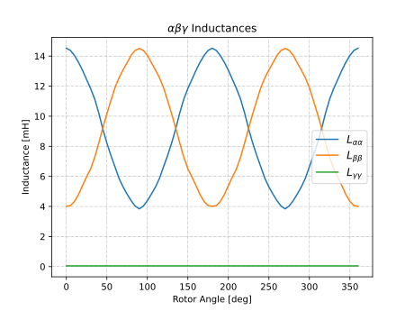

Inductance Analyzer
########################################################################

This analyzer enables the inductance evaluation of a **3-phase** electric machine using raw data from 2D FEA simulations using JMAG.

Model Background
****************

The inductance of a coil is the resistance to a change in the electric current flowing through it. The inductance of a coil
within an electric machine can come from multiple sources, including its own electric current as well as the electric current
flowing through other phases of the machine. Understanding the inductance characteristics of an electric machine leads to finding
any saliency that an electric machine rotor may have. In some electric machines, such as reluctance or induction machines,
saliency exists and aids in producing electromagnetic torque between the rotor and stator. This can be seen in the torque equation
for a 3-phase machine:

.. math::

    T &= \frac{3p}{2}[\psi_\text{pm} I_\text{q} + (L_\text{d} - L_\text{q}) I_\text{d} I_\text{q}] \\

* T. Vo-Duy, and M. C. Ta, *Encyclopedia of Electrical and Electronic Power Engineering*. Oxford: Elsevier, 2023.

where :math:`T` is calculated based on the rotor pole pairs :math:`p`, any permanent magnet flux :math:`\psi_\text{pm}`, the d- and 
q-axis currents :math:`I_\text{d,q}`, and the d- and q-axis inductances :math:`L_\text{d,q}`. In this equation the first term 
:math:`\frac{3p}{2} \psi_\text{pm} I_\text{q}` represents the torque based on the permanent magnet flux and the second term
:math:`\frac{3p}{2} (L_\text{d} - L_\text{q}) I_\text{d} I_\text{q}` represents the reluctance torque, which is generated by different
d- and q-axis inductances.

The code is structured such that the ``inductance_analyzer`` contains the code for taking flux linkage data in the form of .csv files 
and processing it into alpha-beta and d-q inductance arrays. The example below utilitzes the existing 
`flux linkage analyzer <https://emach.readthedocs.io/en/latest/EM_analyzers/flux_linkage_analyzer.html>`_. The analyzer uses the 
following equations to find :math:`L_{\alpha \beta \gamma}` and :math:`L_\text{dq0}`. These are the standard equations for the Clarke
and Park transforms, in this case applied to each phase of the machine calculated at each individual rotor angle:

.. math::

    [L_{\alpha \beta \gamma}] &= [T_\text{C}] [L_\text{abc}] \\
    [L_\text{dq0}] &= [T_\text{P}] [L_{\alpha \beta \gamma}] \\

where :math:`[L_{\alpha \beta \gamma}]` is the alpha-beta inductance matrix, :math:`[T_\text{c}]` is the Clarke transformation matrix,
:math:`[L_\text{abc}]` is the synchronous frame inductance matrix, :math:`[L_\text{dq0}]` is the d-q inductance matrix, and :math:`[T_\text{c}]` 
is the Park transformation matrix. This analyzer is designed to handle any number of phases, given the proper :math:`[T_\text{c}]` is 
provided as an input. From these equations, post-processing of the data can find, for example, cross coupling of inductances and saliency 
ratios.

Input from User
*********************************

This analyzer requires several input parameters, all of which are displayed in the table below:

.. csv-table:: `inductance_analyzer Input`
   :file: input_inductance_analyzer.csv
   :widths: 70, 70, 30
   :header-rows: 1

Example Code
~~~~~~~~~~~~~~~~~~~~~~~~~~~~

Example code defining the flux linkage step is provided below. This code defines the analyzer problem class (input to the analyzer), 
initializes the analyzer class with an explanation of the required configurations, and calls the post-analyzer class. It should be noted
that the example below is used in conjunction with the ``flux_linkage`` analyzer:

.. code-block:: python

    import os
    import sys
    import copy

    from mach_eval import AnalysisStep, ProblemDefinition
    from mach_eval.analyzers.electromagnetic import inductance_analyzer as inductance

    ############################ Define Inductance Step ###########################
    class SynR_Ind_ProblemDefinition(ProblemDefinition):
        """Converts a State into a problem"""

        def __init__(self):
            pass

        def get_problem(state):

            problem = inductance.Inductance_Problem(
                state.conditions.I_hat, 
                state.conditions.path, 
                state.conditions.study_name, 
                state.conditions.rotor_angle, 
                state.conditions.name_of_phases)
            return problem

    clarke_transformation_matrix = 2/3*np.array([[1, -1/2, -1/2], [0, np.sqrt(3)/2, -np.sqrt(3)/2], [1/2, 1/2, 1/2]])

    class SynR_Inductance_PostAnalyzer:
        
        def get_next_state(results, in_state):
            state_out = copy.deepcopy(in_state)

            state_out.conditions.rotor_angle = results["rotor_angle"]
            state_out.conditions.Lalphabeta = results["Lalphabeta"]
            state_out.conditions.Ldq = results["Ldq"]
            L_d = np.mean(state_out.conditions.Ldq[:,0,0])
            L_q = np.mean(state_out.conditions.Ldq[:,1,1])
            saliency_ratio = L_d/L_q

            fig1 = plt.figure()
            ax1 = plt.axes()
            fig1.add_axes(ax1)
            ax1.plot(state_out.conditions.rotor_angle[0], state_out.conditions.Lalphabeta[:,0,0]*1000)
            ax1.plot(state_out.conditions.rotor_angle[0], state_out.conditions.Lalphabeta[:,0,1]*1000)
            ax1.plot(state_out.conditions.rotor_angle[0], state_out.conditions.Lalphabeta[:,1,0]*1000)
            ax1.plot(state_out.conditions.rotor_angle[0], state_out.conditions.Lalphabeta[:,1,1]*1000)
            ax1.plot(state_out.conditions.rotor_angle[0], state_out.conditions.Lalphabeta[:,2,2]*1000)
            ax1.set_xlabel("Rotor Angle [deg]")
            ax1.set_ylabel("Inductance [mH]")
            ax1.set_title(r"$\alpha \beta \gamma$ Inductances")
            plt.legend([r"$L_{\alpha \alpha}$", r"$L_{\alpha \beta}$", r"$L_{\beta \alpha}$", r"$L_{\beta \beta}$", r"$L_{\gamma \gamma}$"], fontsize=12)
            plt.grid(True, linewidth=0.5, color="#A9A9A9", linestyle="-.")
            plt.show()

            fig2 = plt.figure()
            ax2 = plt.axes()
            fig2.add_axes(ax2)
            plt.plot(state_out.conditions.rotor_angle[0], state_out.conditions.Ldq[:,0,0]*1000)
            plt.plot(state_out.conditions.rotor_angle[0], state_out.conditions.Ldq[:,1,1]*1000)
            plt.plot(state_out.conditions.rotor_angle[0], state_out.conditions.Ldq[:,2,2]*1000)
            ax2.set_xlabel("Rotor Angle [deg]")
            ax2.set_ylabel("Inductance [mH]")
            ax2.set_title("dq0 Inductances")
            plt.legend(["$L_d$", "$L_q$", "$L_0$"], fontsize=12)
            plt.grid(True, linewidth=0.5, color="#A9A9A9", linestyle="-.")
            plt.show()

            print("\n************************ INDUCTANCE RESULTS ************************")
            print("Ld = ", L_d*1000, " mH")
            print("Lq = ", L_q*1000, " mH")
            print("Saliency Ratio = ", saliency_ratio)
            print("*************************************************************************\n")

            return state_out

    SynR_inductance_analysis = inductance.Inductance_Analyzer(clarke_transformation_matrix)

    SynR_inductance_step = AnalysisStep(SynR_Ind_ProblemDefinition, SynR_inductance_analysis, SynR_Inductance_PostAnalyzer)

It should be noted that this code should be contained as an analysis step in the main folder of the eMach repository. It must be contained 
within the same folder as the code below in order for the code below to run.

Output to User
**********************************

The ``flux_linkage_analyzer`` returns a directory holding the results obtained from the transient analysis of the machine. The elements 
of this dictionary and their descriptions are provided below:

.. csv-table:: `inductance_analyzer Output`
   :file: output_inductance_analyzer.csv
   :widths: 70, 70
   :header-rows: 1

The following code should be used to run the example analysis:

.. code-block:: python

    import os
    import sys
    from time import time as clock_time

    os.chdir(os.path.dirname(__file__))
    sys.path.append("../../../")

    from mach_eval import (MachineEvaluator, MachineDesign)
    from SynR_flux_linkage_step import SynR_flux_linkage_step
    from SynR_inductance_step import SynR_inductance_step
    from example_SynR_machine import Example_SynR_Machine, Machine_Op_Pt

    ############################ Create Evaluator #####################
    SynR_evaluator = MachineEvaluator(
        [
            SynR_flux_linkage_step,
            SynR_inductance_step
        ]
    )

    design_variant = MachineDesign(Example_SynR_Machine, Machine_Op_Pt)

    tic = clock_time()
    results = SynR_evaluator.evaluate(design_variant)
    toc = clock_time()

    print("Time spent on SynR evaluation is %g min." % ((toc- tic)/60))

All example SynR evaluation scripts, including the one used for this analyzer, can be found in ``eMach\examples\mach_eval_examples\SynR_eval``,
where the post-analyzer script uses FEA results and calculates machine performance metrics, including torque density, power density, efficiency,
and torque ripple. This analyzer can be run by simply running the ``SynR_evaluator`` file in the aforementioned folder using the ``inductance_step``.

This example should produce the following results:

.. figure:: ./Images/d_q_inductances.svg
   :alt: d_q_inductances 
   :align: center
   :width: 500 

.. csv-table:: `inductance_analyzer Results`
   :file: results_inductance_analyzer.csv
   :widths: 70, 70, 30
   :header-rows: 1
   :align: center

It should be noted that the inductance values calculated will be dependent on the number of turns in the stator. The saliency ratio however will 
remain independent of this.